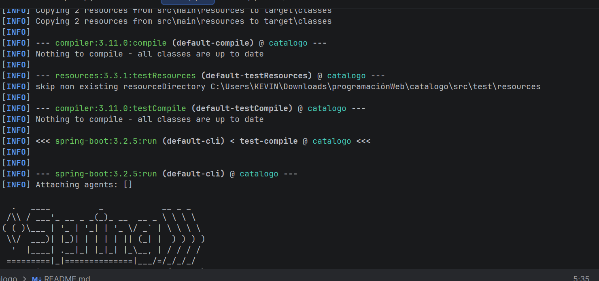
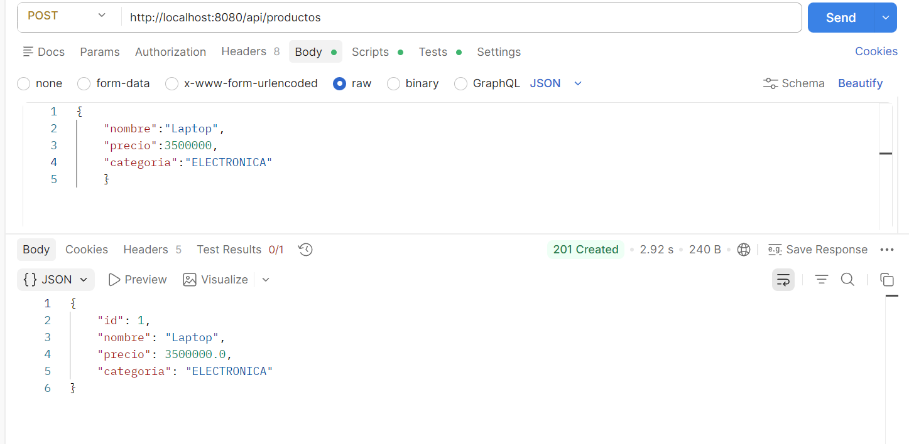
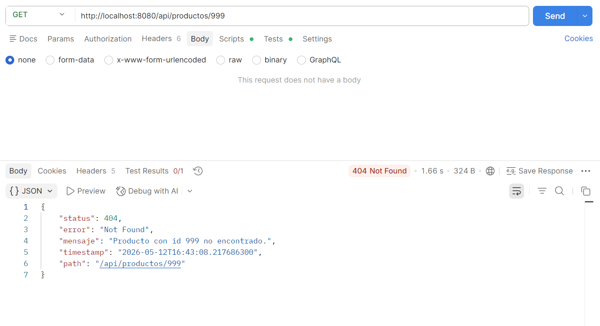
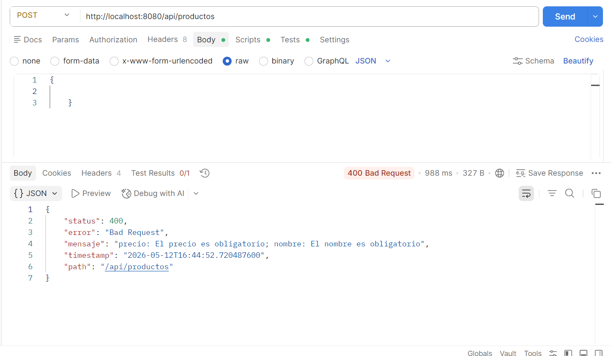

# Refactorizacion con SOLID, DAO/DTO y @RestControllerAdvice

## Autor

- **Nombre:** Jhoseth Esneider Rozo Carrillo
- **Codigo:** 02230131027
- **Programa:** Ingenieria de Sistemas
- **Unidad:** 11 Buenas Practicas y Patrones de Diseno
- **Actividad:** Post-Contenido 1
- **Fecha:** 2026

---

## Descripcion del Proyecto

Este proyecto consiste en la refactorizacion de una API REST desarrollada con Spring Boot aplicando buenas practicas de arquitectura y patrones de diseno.

La aplicacion implementa principios SOLID, especialmente:

- SRP (Single Responsibility Principle)
- DIP (Dependency Inversion Principle)

Ademas, se implementan los patrones:

- DAO mediante `ProductoRepository`
- DTO para separar datos de entrada y salida
- Factory para conversion centralizada entre entidades y DTOs

Tambien se centraliza el manejo de errores utilizando:

- `@RestControllerAdvice`
- `ApiError`
- Excepciones personalizadas

La API permite crear, consultar y eliminar productos utilizando respuestas JSON estandarizadas.

---

## Tecnologias Utilizadas

- **Java 17**
- **Spring Boot 3.2.x**
- **Spring Web**
- **Spring Data JPA**
- **H2 Database**
- **Jakarta Validation**
- **Maven 3.9.x**
- **Hibernate**
- **Postman**
- **IntelliJ IDEA / VS Code**

---

## Arquitectura Implementada

La aplicacion esta organizada por capas para mantener separacion de responsabilidades y facilitar el mantenimiento.

### Principios SOLID Aplicados

#### SRP - Single Responsibility Principle

Cada clase tiene una unica responsabilidad:

- `ProductoController` maneja solicitudes HTTP
- `ProductoServiceImpl` contiene logica de negocio
- `ProductoRepository` accede a la base de datos
- `ProductoFactory` convierte entidades y DTOs
- `GlobalExceptionHandler` maneja excepciones

#### DIP - Dependency Inversion Principle

El controlador depende de la abstraccion `ProductoService` y no directamente de la implementacion.

---

## Estructura del Proyecto

```text
src/main/java/com/empresa/catalogo/
├── controller/
│   └── ProductoController.java
│
├── service/
│   ├── ProductoService.java
│   └── ProductoServiceImpl.java
│
├── repository/
│   └── ProductoRepository.java
│
├── dto/
│   ├── ProductoRequestDTO.java
│   └── ProductoResponseDTO.java
│
├── entity/
│   └── Producto.java
│
├── factory/
│   └── ProductoFactory.java
│
└── exception/
    ├── ApiError.java
    ├── GlobalExceptionHandler.java
    └── RecursoNoEncontradoException.java
```

---

## Diagrama de Arquitectura en Texto

```text
Cliente
   |
   v
ProductoController
   |
   v
ProductoService (Interfaz)
   |
   v
ProductoServiceImpl
   |
   +-------------------+
   |                   |
   v                   v
ProductoFactory   ProductoRepository
   |                   |
   v                   v
DTOs              Base de Datos H2
   |
   v
Respuesta JSON
```

---

## Entidad Producto

La entidad `Producto` representa la informacion almacenada en la base de datos.

### Campos

- `id`
- `nombre`
- `precio`
- `categoria`
- `activo`

### Validaciones

- `@NotBlank` en `nombre`
- `@Positive` en `precio`

---

## DTOs Implementados

### ProductoRequestDTO

Representa los datos enviados por el cliente hacia la API.

```java
@NotBlank(message = "El nombre es obligatorio")
private String nombre;

@Positive(message = "El precio debe ser mayor a cero")
private Double precio;
```

### ProductoResponseDTO

Representa los datos enviados por la API al cliente.

No expone informacion innecesaria y mantiene separacion entre entidad y respuesta.

---

## Factory Implementado

`ProductoFactory` centraliza la conversion entre:

- DTO -> Entity
- Entity -> DTO

Esto evita duplicacion de codigo y mejora el mantenimiento.

---

## DAO Implementado

El patron DAO se implementa mediante:

```java
public interface ProductoRepository extends JpaRepository<Producto, Long>
```

El repository contiene:

```java
List<Producto> findByActivoTrue();
```

---

## Manejo Global de Excepciones

La aplicacion implementa un manejador global utilizando:

```java
@RestControllerAdvice
```

### Excepciones Capturadas

#### 404 - Recurso No Encontrado

```java
@ExceptionHandler(RecursoNoEncontradoException.class)
```

#### 400 - Error de Validacion

```java
@ExceptionHandler(MethodArgumentNotValidException.class)
```

#### 500 - Error General

```java
@ExceptionHandler(Exception.class)
```

---

## Modelo de Error API

La clase `ApiError` estandariza las respuestas de error.

### Campos

```text
status
error
mensaje
timestamp
path
```

---

## Configuracion de application.properties

```properties
spring.application.name=catalogo

spring.h2.console.enabled=true
spring.datasource.url=jdbc:h2:mem:catalogodb
spring.datasource.driverClassName=org.h2.Driver
spring.datasource.username=sa
spring.datasource.password=

spring.jpa.hibernate.ddl-auto=update
spring.jpa.show-sql=true

server.port=8080
```

---

## Dependencias Maven

```xml
<dependencies>

    <dependency>
        <groupId>org.springframework.boot</groupId>
        <artifactId>spring-boot-starter-web</artifactId>
    </dependency>

    <dependency>
        <groupId>org.springframework.boot</groupId>
        <artifactId>spring-boot-starter-data-jpa</artifactId>
    </dependency>

    <dependency>
        <groupId>com.h2database</groupId>
        <artifactId>h2</artifactId>
        <scope>runtime</scope>
    </dependency>

    <dependency>
        <groupId>org.springframework.boot</groupId>
        <artifactId>spring-boot-starter-validation</artifactId>
    </dependency>

</dependencies>
```

---

## Instrucciones de Ejecucion

### 1. Clonar el repositorio

```bash
git clone https://github.com/usuario/apellido-post1-u11.git
```

### 2. Entrar al proyecto

```bash
cd apellido-post1-u11
```

### 3. Compilar el proyecto

```bash
mvn compile
```

### 4. Ejecutar la aplicacion

```bash
mvn spring-boot:run
```

La aplicacion iniciara en:

```text
http://localhost:8080
```

---

## Endpoints Implementados

### Crear Producto

```http
POST /api/productos
```

### Body

```json
{
  "nombre": "Laptop",
  "precio": 3500000,
  "categoria": "ELECTRONICA"
}
```

### Respuesta Exitosa

```json
{
  "id": 1,
  "nombre": "Laptop",
  "precio": 3500000,
  "categoria": "ELECTRONICA"
}
```

---

### Obtener Productos Activos

```http
GET /api/productos
```

### Respuesta

```json
[]
```

---

### Buscar Producto por ID

```http
GET /api/productos/1
```

---

### Eliminar Producto

```http
DELETE /api/productos/1
```

---

## CHECKPOINTS DE VERIFICACION

## Checkpoint 1 - Entidad, DTOs y Factory

Verificaciones realizadas:

- Proyecto compila correctamente con:

```bash
mvn compile
```

- `Producto.java` creada correctamente
- `ProductoRequestDTO` implementa:
  - `@NotBlank`
  - `@Positive`
- `ProductoResponseDTO` creado
- `ProductoFactory` implementado correctamente

---

## Checkpoint 2 - Service, DIP y Repository

### Verificaciones realizadas

La aplicacion inicia correctamente:

```bash
mvn spring-boot:run
```

### GET productos

```http
GET /api/productos
```

Respuesta esperada:

```json
[]
```

### POST exitoso

```http
POST /api/productos
```

Body:

```json
{
  "nombre": "Laptop",
  "precio": 3500000,
  "categoria": "ELECTRONICA"
}
```

Respuesta esperada:

```json
{
  "id": 1,
  "nombre": "Laptop",
  "precio": 3500000,
  "categoria": "ELECTRONICA"
}
```

---

## Checkpoint 3 - GlobalExceptionHandler

### Verificacion Error 404

```http
GET /api/productos/999
```

Respuesta esperada:

```json
{
  "status": 404,
  "error": "Not Found",
  "mensaje": "Producto con id 999 no encontrado."
}
```

### Verificacion Error 400

```http
POST /api/productos
```

Body:

```json
{}
```

Respuesta esperada:

```json
{
  "status": 400,
  "error": "Bad Request",
  "mensaje": "nombre: El nombre es obligatorio; precio: El precio debe ser mayor a cero"
}
```

---

## Capturas del Proyecto

Las capturas se encuentran en la carpeta:

```text
/evidencias/
```

### Capturas Incluidas

- Compilacion exitosa
- Aplicacion ejecutandose
- POST exitoso
- Error 404
- Error 400
- Respuestas JSON desde Postman

---

## Convenciones Aplicadas

- Clases en PascalCase
- Metodos y variables en camelCase
- DTOs con sufijo `DTO`
- Factory con sufijo `Factory`
- Servicios mediante interfaz
- Paquetes organizados por capas

---

## Repositorio GitHub

```text
apellido-post1-u11
```

---

## Conclusiones

La refactorizacion permitio mejorar la organizacion del proyecto aplicando principios SOLID y patrones de diseno utilizados en aplicaciones empresariales con Spring Boot.

La separacion por capas facilita:

- mantenimiento
- reutilizacion
- escalabilidad
- pruebas
- legibilidad del codigo

El uso de DTOs, Factory y manejo global de excepciones permite construir una API mas limpia, desacoplada y profesional.

---

## Capturas del Proyecto

Las siguientes capturas se encuentran en la carpeta `/evidencias/`:

## App corriendo



## Post retorna 201



## Error Get 404



## Error Post 400


